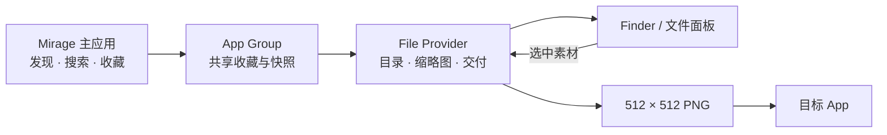

<p align="center">
  
</p>

<h1 align="center">Mirage</h1>

<p align="center"><strong>网络图片，直接出现在 macOS 上传框里。</strong></p>

<p align="center">
  发现 Openverse 图片与 DiceBear 头像，核对来源，按需收藏，再从 Finder 或系统文件面板直接选择。<br>
  不必先下载、整理文件，再回到原来的窗口上传。
</p>

<p align="center">
  <a href="https://github.com/shaun17/Mirage/releases/tag/v0.3.0"><strong>下载 Mirage 0.3.0</strong></a> ·
  <a href="#快速开始">快速开始</a> ·
  <a href="https://github.com/shaun17/Mirage">应用源码</a>
</p>

<p align="center"><sub>macOS 14+ · 支持 Apple Silicon 与 Intel Mac</sub></p>

<p align="center">
  
</p>

## 少一次下载，少一次整理

Mirage 是一款 macOS 图片素材工具。主应用负责发现、搜索、查看来源和收藏素材；内置的 File Provider 扩展则让 Mirage 出现在 Finder 与系统文件面板的“位置”中。

打开网页或 App 的上传框时，可以直接进入 Mirage 选择素材。只有真正选中后，Mirage 才会获取远程内容，并交付标准化的 PNG 文件。

## 从发现到上传

1. **发现素材** — 按“头像”“图片”或“全部”筛选，搜索 Openverse 图片与 DiceBear 头像。
2. **核对并收藏** — 查看作者、来源页和许可证信息，把可能会用到的内容加入收藏。
3. **直接选择** — 在上传面板左侧的“位置”中打开 Mirage，从推荐内容、头像、收藏或最近使用中选择。

最终上传仍由目标 App 或网页完成；Mirage 只负责把远程素材交给 macOS 文件面板。

## 主要功能

- **搜索与连续浏览** — 搜索图片或头像，并通过分页和“更多图片”继续查看结果。
- **Finder 与文件面板接入** — 不离开当前上传流程，直接从系统文件面板选择素材。
- **收藏与最近使用** — 主应用中的收藏会同步到文件面板；成功交付的图片会进入最近使用。
- **来源信息可查** — 在详情中查看作者、来源页、许可证和使用提醒。
- **按需获取内容** — 预览与收藏不会制造临时原图，选中素材时才完成文件交付。
- **统一 PNG 输出** — 校验源文件、修正方向并居中裁切，输出 512 × 512 sRGB PNG，同时移除源文件元数据。

<p align="center">
  
</p>

## 安装

当前正式版本为 `0.3.0`。公开安装包已验证为 Apple Silicon 与 Intel 通用构建，并完成 Developer ID 签名和 Apple 公证。

1. 下载 [`Mirage-0.3.0.dmg`](https://github.com/shaun17/Mirage/releases/download/v0.3.0/Mirage-0.3.0.dmg)。
2. 打开 DMG，将 Mirage 拖入 `Applications`。
3. 首次启动 Mirage，等待文件提供程序完成初始化。
4. 如果应用提示扩展尚未启用，请前往“系统设置 → 通用 → 登录项与扩展 → 文件提供程序”，启用 Mirage。

<details>
<summary>校验下载文件</summary>

同时下载 [`Mirage-0.3.0.dmg.sha256`](https://github.com/shaun17/Mirage/releases/download/v0.3.0/Mirage-0.3.0.dmg.sha256)，将两个文件放在同一目录后运行：

```bash
shasum -a 256 -c Mirage-0.3.0.dmg.sha256
```

</details>

## 快速开始

1. 打开 Mirage，浏览或搜索图片，按需收藏素材。
2. 在目标 App 或网页中打开上传框。
3. 在系统文件面板左侧的“位置”中选择 Mirage。
4. 打开推荐内容、“头像”“收藏”或“最近使用”；需要继续浏览时进入“更多图片”。
5. 选中素材。Mirage 会准备 512 × 512 PNG，再由目标 App 完成上传。

## Mirage 如何进入文件面板



主应用与 File Provider 通过 App Group 共享收藏、最近使用和推荐快照。File Provider 是只读素材入口：它可以枚举、预览和交付内容，但不会创建、修改或删除远端素材。

## 系统要求

- macOS 14.0 或更高版本。
- 新搜索、图片预览和首次获取远程素材通常需要网络连接。
- File Provider 的动态字符串搜索需要 macOS 26 或更高版本；旧系统仍可浏览已枚举内容并使用系统本地索引。
- File Provider 必须处于启用状态；Mirage 会在主应用中显示当前状态和设置入口。

## 数据、隐私与素材来源

- 当前实现没有账号系统，也没有引入分析或遥测 SDK。
- Openverse 搜索会通过 HTTPS 把图片搜索词发送到 `api.openverse.org`；Mirage 当前只接纳 CC0 1.0 与 Public Domain Mark 图片记录。
- DiceBear 的原始搜索文字只在本地用于生成 SHA-256 seed，远程头像 URL 不包含原始查询文字。
- Openverse 的缩略图和源图可能来自结果所指向的第三方 HTTPS 图片主机。
- 收藏、最近使用、推荐快照、同步状态和 File Provider 搜索数据以 JSON 保存在沙盒 App Group 中，没有额外的应用层加密。
- 输出 PNG 不保留来源和许可证元数据。使用素材前，仍需在详情或来源页核对署名、肖像权、商标权及其他适用限制。

Mirage 展示的来源和许可证信息用于协助核对，不构成法律保证；DiceBear 不同头像风格的许可也可能不同。

## 当前限制

- Mirage 是只读素材入口，不是云盘或通用文件管理器。
- 输出固定为居中裁切后的 512 × 512 PNG，不保留原始尺寸、格式或 EXIF。
- 源图下载上限为 20 MiB、1 亿像素，并只接受受支持的图片格式。
- 外部服务可能出现网络错误、限流、内容下架或元数据变化。
- 内容安全过滤依赖来源服务提供的标记和文字元数据，不能保证所有结果都适合所有用户。

## 本仓库：Mirage 官网

本仓库包含 Mirage 产品官网源码，应用本体与 File Provider 扩展位于 [`shaun17/Mirage`](https://github.com/shaun17/Mirage)。官网中的 Logo、窗口截图和演示视频都保存在 `public/media/`，不依赖第三方图床。

本地开发需要 Node.js `22.13.0+`：

```bash
npm ci
npm run dev
```

浏览器打开 `http://localhost:3000`。提交前运行：

```bash
npm run lint
npm test
```

`npm test` 会完成生产构建，并验证首页 HTML 与必需的本地媒体文件。项目构建目标为 Cloudflare Worker；本仓库当前没有自动部署脚本，也不包含部署凭据。

## 许可证

本仓库与 Mirage 应用仓库当前均未包含 `LICENSE` 文件，因此不声明任何开源许可证。
