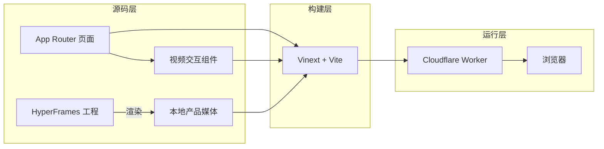
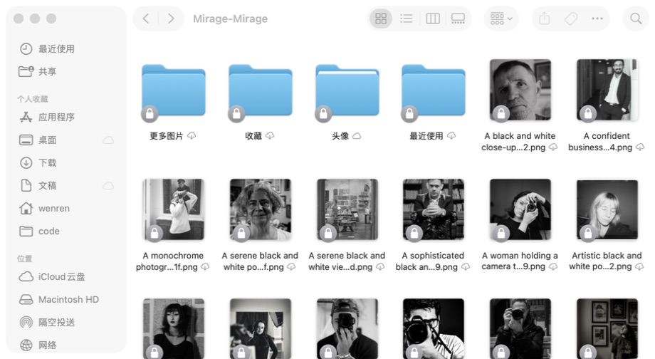

---
tags:
  - project
  - typescript
  - product-website
  - nextjs
created: 2026-08-02
---

<p align="center">
  
</p>

<h1 align="center">Mirage Website</h1>

<p align="center">
  Mirage 的产品官网：用真实的 macOS 窗口截图与短视频，说明网络图片如何直接进入 Finder 和系统文件选择器。
</p>

> [!info]
> 这是官网源码仓库；Mirage macOS 应用本体位于 [`shaun17/Mirage`](https://github.com/shaun17/Mirage)。

**仓库：** [`shaun17/mirage-website`](https://github.com/shaun17/mirage-website)<br>
**版本：** `0.1.0`<br>
**语言：** TypeScript / React<br>
**运行环境：** Node.js `22.13.0+`<br>
**本地地址：** `http://localhost:3000`

## 整体架构



> [!note]
> 官网不热链产品素材。图标、窗口截图和演示视频均随仓库提供；视频源工程与最终 MP4 分开保留，方便后续重新剪辑。

## 目录结构

```text
mirage-website/
├── app/
│   ├── components/       # 产品演示视频及播放状态
│   ├── globals.css       # 页面视觉、响应式布局与动效
│   ├── layout.tsx        # 元数据、站点图标与根布局
│   └── page.tsx          # 单页产品官网
├── public/media/         # Logo、真实应用截图与最终演示视频
├── videos/mirage-app-loop/
│   ├── assets/           # 视频工程使用的本地素材
│   ├── index.html        # HyperFrames 场景实现
│   └── shot-plan.json    # 镜头节奏与画面规划
├── worker/index.ts       # Cloudflare Worker 入口
├── tests/                # 构建产物与本地媒体验证
├── vite.config.ts        # Vinext、Vite 与 Cloudflare 配置
└── package.json          # Node.js 脚本与依赖版本
```

## 技术栈速查

| 层级 | 技术 | 版本 | 用途 |
| --- | --- | --- | --- |
| 运行时 | Node.js | `22.13.0+` | 本地开发与构建 |
| 页面 | Next.js / React | `16.2.12` / `19.2.6` | App Router 页面与客户端交互 |
| 构建 | Vinext / Vite | `0.0.50` / `8.0.13` | 将 Next.js 页面构建到 Cloudflare 运行时 |
| 样式 | Tailwind CSS | `4.2.1` | CSS 构建链；主要视觉规则位于 `app/globals.css` |
| 部署适配 | Cloudflare Vite Plugin / Wrangler | `1.37.1` / `4.92.0` | Worker 本地运行与构建 |
| 语言 | TypeScript | `5.9.3` | 页面、组件与 Worker 类型检查基础 |

## 核心特点

| 特点 | 说明 |
| --- | --- |
| 真实产品画面 | 只使用 Mirage 本机窗口截图，不用概念图代替产品界面 |
| 视频优先的 Hero | 桌面端采用左右布局，并把更高视觉权重留给产品演示 |
| 本地媒体交付 | Logo、截图与 MP4 位于 `public/media/`，不依赖第三方图床 |
| 尊重动态偏好 | 检测 `prefers-reduced-motion`；减少动态时用 Finder 静态图替代视频 |
| 按可见性播放 | 演示离开视口后自动暂停，同时保留手动播放与暂停按钮 |
| 可验证构建 | Node 测试检查首页 HTML、产品链接和全部必需媒体文件 |

## 产品内容与媒体

<p align="center">
  
</p>

| 资源 | 路径 | 用途 |
| --- | --- | --- |
| Mirage Logo | `public/media/mirage-icon.png` | README 图标、网站品牌标识与页面 favicon |
| 产品截图 | `public/media/mirage-*.jpg` | Hero 海报、Finder 场景与功能模块 |
| 演示视频 | `public/media/mirage-app-loop.mp4` | Hero 中循环播放的 7 秒产品路径演示 |
| 视频源工程 | `videos/mirage-app-loop/` | 调整镜头、素材与节奏后重新生成 MP4 |

官网讲述的是 Mirage 的核心路径：发现 Openverse 图片或 DiceBear 头像，收藏后在 Finder 与系统文件面板中直接选择，并在真正选择时才获取原图。

## 本地运行

```bash
git clone https://github.com/shaun17/mirage-website.git
cd mirage-website
npm ci
npm run dev
```

浏览器打开 `http://localhost:3000`。

## CLI 命令速查

| 命令 | 功能 |
| --- | --- |
| `npm run dev` | 启动本地开发服务器 |
| `npm run build` | 生成 Cloudflare 兼容的生产构建 |
| `npm run start` | 本地运行生产构建 |
| `npm run lint` | 检查页面、Worker 与构建配置 |
| `npm test` | 先构建，再验证渲染 HTML 与全部必需媒体 |

## 配置参考

| 配置 | 当前值 | 说明 |
| --- | --- | --- |
| `engines.node` | `>=22.13.0` | 低于此版本不在项目支持范围内 |
| `WRANGLER_LOG_PATH` | `.wrangler/wrangler.log` | npm 脚本将 Wrangler 日志保存在项目内 |
| `compatibility_flags` | `nodejs_compat` | Worker 构建启用 Node.js 兼容层 |
| `.openai/hosting.json` → `d1` | `null` | 当前不绑定 Cloudflare D1 |
| `.openai/hosting.json` → `r2` | `null` | 当前不绑定 Cloudflare R2 |

## 构建与部署目标

```bash
npm run lint
npm test
```

`npm test` 会执行生产构建，并用 Node.js 测试读取 `dist/server/index.js`。项目已配置 Cloudflare Worker 入口与 Vite 插件，但仓库当前没有部署脚本，也不包含部署凭据；本地验收完成后再单独接入 Cloudflare 发布流程。

## 关键边界与约束

| 边界 | 说明 |
| --- | --- |
| 官网与应用分离 | 本仓库只包含产品官网；macOS App、File Provider 扩展与安装包不在这里 |
| 无服务端业务数据 | 当前没有账号系统、数据库、对象存储或业务 API |
| 安装包尚未发布 | 页面下载入口目前指向 Mirage 源码仓库，等待正式 GitHub Release |
| 媒体必须本地存在 | 删除或改名 `public/media/` 中的必需资源会导致自动测试失败 |
| 产品系统要求 | 官网可在现代浏览器访问；页面中标注的 `macOS 14+` 是 Mirage App 的要求 |
